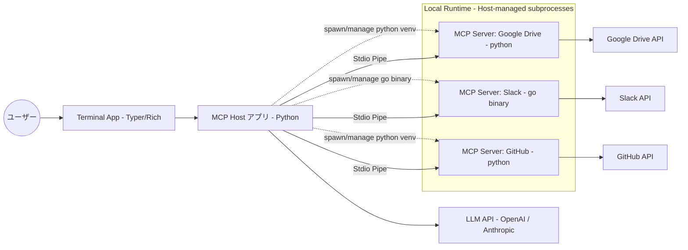

# 社内情報横断検索システム PoC 企画書 (MCPアーキテクチャ版)

## 1. 背景と目的
社内に散在するドキュメント（Google Drive, Slack, GitHub）を横断的に検索し、情報の所在と概要を把握できる環境を構築する。
今回は**概念実証（PoC）を最優先**とし、体験の成立を重視する。
技術選定は **MCP (Model Context Protocol)** を採用し、データソースごとの実装コストを削減しながら将来拡張性とリアルタイム性を担保する。

## 2. システム基本方針
*   **MCPの採用:** 各サービス（Drive, Slack, GitHub）との接続には、標準化されたプロトコルである MCP を使用する。これにより、将来的にツールが増えた際も共通のインターフェースで拡張可能とする。
*   **UIの構築:** Python製CLI（Typer + Rich）による対話型REPLとして提供する。
*   **エージェント型検索:** 事前にデータをDBに溜め込むのではなく、ユーザーの質問に応じてAIがリアルタイムに各MCPサーバー（API）を呼び出し、情報を取得する「エージェント型」の挙動とする。
*   **サブプロセス管理 + オンデマンド呼び出し:** ホストアプリが Slack/GitHub/Drive の MCP サーバーをサブプロセスとして起動・管理し、接続・認証をウォーム状態に保つ。Python製サーバー（Drive/GitHub）はホスト上の venv で `python -m ...` もしくは `pip install` したエントリポイントを実行し、Slack サーバーは Go 製単体バイナリ（`slack-mcp-server`）をパス指定で起動する。アプリは単一のPythonプロセスとして起動し、TyperベースのREPLループ内で入力を受け付ける。データ取得は毎リクエストでリアルタイムに API を叩く方針とし、概念実証に専念する。
*   **通信方式:** 各MCPサーバーとは Stdio (標準入出力) のパイプを通じて通信する。HTTP/SSE のラッパーサーバーは本PoCでは不要とし、ポート管理を排除する。PoCではすべてローカルプロセス起動だが、配布形態に応じて起動手段を分ける（Pythonサーバーは venv 上のモジュール起動、Slack サーバーは Go バイナリ起動）。Stdio通信の安定性を最優先とし、トークンリフレッシュなどで生成された認証ファイルはホストファイルシステム上に直接保存され、再起動ごとの再認証を避ける。
*   **認証フロー:** Web UIは用いず、**初回起動時のみホストアプリがサブプロセスを起動しつつ対話的にOAuthを案内**する（ブラウザを自動で開く／認証URLを表示する）。認証ファイル生成後は同じディレクトリを参照して自動で再利用し、ユーザーにサーバーを手動起動させない。Slackは例外的に利用者本人の User Token (xoxp-) を事前取得・環境変数設定する前提としつつ、ホストが単一プロセスでサーバーを起動・管理して二重起動やポート／パイプ競合を避ける。トークン保存はローカル端末に限定し、環境変数やOSキーチェーンなど安全なストレージを推奨する。
*   **認可のPoC前提:** PoC期間は「実行ユーザー本人の権限」をそのまま利用する。Slackは個人の User Token を用い、本人がアクセスできる全チャンネル（Public/Private）およびDMを検索対象とする。共有資格情報やBot招待前提の記述は撤廃し、プロダクション移行時にBot運用または最小権限のスコープ分離へ切り替える想定であることを明示する。トークン保存はローカル限定で行い、Gitへのコミット禁止とする。
*   **Slack検索方針 (PoC):** PoCでは体験優先で **User Token (xoxp-) を用いた `search.messages`** とし、Bot招待を不要化して利用者本人が参加する全チャンネル＋DMを対象にする。PoCの割り切りとして、各ユーザーにトークン取得（またはOAuth認証）の手動セットアップ負荷を許容する。プロダクション化時はセキュリティ統制のため、Bot運用または Enterprise Grid の監査API/Data Access API への移行を検討する。DM/PrivateをLLMに送る際の自動マスキングは未実装（PoCの割り切り）であることを明記し、取り扱いに注意する。
*   **回答のトレーサビリティ:** 回答本文と同時に、根拠となったファイル/メッセージの所在（URL またはパス）を返却し、ユーザーが一次情報に即アクセスできることを必須要件とする。
*   **検索クエリ生成:** LLMはユーザー質問を各ツールの検索構文（例: Slack `from:manager "project alpha" after:2023-01-01`, GitHub `repo:org/repo path:docs project alpha`, Drive `name:project alpha type:document` 等）へ正規化してからAPIを呼び出すことを必須要件とする。構文知識はプロンプトまたはMCPサーバー提供のリソーステンプレートで注入する。
*   **検索方式の前提:** MCPおよびバックエンドAPIが提供するのは「キーワード検索（全文検索）」のみであり、ベクトルやEmbeddingを用いたセマンティック検索（意味検索）は本PoCでは実施しない。代替策として、LLMによるクエリ拡張（Query Expansion）を必須とし、ユーザー入力に加えて類義語・同義語・関連語を自動生成し、OR検索などでヒット率を底上げする方針を明記する。
*   **コンテンツ取得方針:** Rerank/Filterは行わず、各ツールの検索APIでヒットした上位結果をサービスごと上限3件・合計上限9件までそのまま取得対象とする。`read_resource` 時は **原則全文を取得** する。

## 3. システム構成図

従来の「データの事前学習（RAG）」ではなく、「ツールの動的利用」を行う構成です。Host がサブプロセスとしてMCPサーバーを起動・制御するニュアンスを示しています。

## 4. 機能要件 (PoCスコープ)

### A. ユーザーインターフェース (UI)
*   **ターミナル対話画面:** Typerで実装したCLI REPLに自然言語で質問を入力し、RichでMarkdownレンダリングした回答を表示する。
*   **進行状況表示:** 「Searching Slack...」「Reading files...」「Summarizing...」などの思考プロセスを逐次表示する。
*   **ソース表示:** 回答の根拠となったファイルやメッセージのURL（またはパス）を明示する。回答直下に「根拠リンク」セクションを設け、最大3件を番号付きで表示（タイトルまたはスニペット + URL/パス）。リンク欠損時はパスのみ表示する。
*   **クエリ可視化:** LLMが生成した検索クエリ（各ツールの構文）をユーザーに併記し、0件時は候補クエリを提示して手動で再実行できるようにする。

### B. バックエンド (MCP Host)
*   **ツールルーティング:** ユーザーの質問意図（例：「Slackを調べて」）に基づき、適切なMCPサーバーを選択して命令を送る。ツール未指定時は Slack/Drive/GitHub を軽量クエリで並列実行し、各サービスで上位3件まで、全体で最大9件を取得する方針とする。APIレートリミット(429)を避けるため、ツール毎の `max_results` は3件に設定し、Rerank無しで取得まで進める。
*   **サブプロセス起動ロジック:** Host はサーバーごとに起動コマンドを切り替える。`type: python` は venv 上で `python -m` / エントリポイント実行、`type: binary` は実行ファイルパスを直接 `subprocess.Popen` で起動する。設定ファイル（例: `servers.yaml`）に `command` と `kind` を保持し、同一の待受/リカバリロジックで扱う。
*   **ソース保持:** URL/パスはLLMに生成させず、MCPサーバーのレスポンスに含まれる resource.uri / url / path などのメタデータをHostアプリ側で結合・管理し、そのままレスポンスへ添付する。これによりハルシネーション（存在しないURL生成）を防ぐ。取得失敗時は回答本文を優先しつつ、ソース欄に警告を付与する。
*   **並列検索とコンテンツ取得 (Parallel Retrieval):** Step 1: 各ツールを並列で検索し、サービスごと上位3件・合計上限9件まで収集する。Step 2: 収集したリソースに対し、`read_resource` を非同期（asyncio等）で並列実行する。本文は原則全文を取得し（APIのサイズ制限に当たる場合は分割取得）、Rerank/Filterは挟まずにLLMへ渡す。
*   **要約生成:** MCPサーバーから返ってきた生データを、LLMを用いて人間が読みやすい形に要約・回答する。
*   **検索構文ナレッジ:** Slack/GitHub/Drive などツール別の Query Syntax をプロンプトに注入するか、MCPサーバーの `list_prompts` / リソーステンプレートから取得してLLMに渡す。構文更新の責務をどこに置くか（サーバー側リソース提供 or Host側チートシート管理）を明示する。
*   **クエリ拡張必須化:** ベクトル検索を行わない代わりに、LLMがユーザー入力を基に類義語・同義語・関連語を生成し、OR検索などでクエリ拡張した上で各APIを呼び出すことを必須ロジックとする。
*   **コンテキスト最適化:** 取得した複数リソースをLLMに渡す際も、各リソースは原則全文を利用する。
*   **0件ハンドリング:** 自動リトライは行わず、0件である旨を即時表示し、日付範囲拡大やキーワード緩和などの代替クエリ候補を提示。ユーザーが再実行を選択するフローとし、効率的に試行できるようにする。

### C. 接続対象データ (MCP Servers)
以下の公式またはコミュニティ製MCPサーバーを、ローカルコマンドとして起動し、Stdio 経由で接続する。配布形態により起動方法を分岐する（Pythonサーバーは venv、Slack は Go バイナリ）。
1.  **Google Drive:** ファイル名検索、ファイル内容の読み取り。  
    *PoC推奨サーバー:* `modelcontextprotocol/servers` に含まれる `gdrive` リファレンス実装（Python）。venv 上で `pip install -e .` して起動し、OAuth設定のみで動作。
2.  **GitHub:** リポジトリ検索、コード/Issueの読み取り。  
    *PoC推奨サーバー:* GitHub公式の `github/github-mcp-server`。venv 上で `pip install` して起動し、PATまたはOAuthで即接続可能（Stdio接続をデフォルトサポート）。
3.  **Slack:** チャンネル履歴の検索、特定スレッドの読み取り。  
    *PoC推奨サーバー:* `korotovsky/slack-mcp-server`（Stdio対応のGo製単体バイナリ）。`go install github.com/korotovsky/slack-mcp-server@latest` で導入するか、GitHub Releases からバイナリを配置する。Python/pip ではインストール不可。  
    *起動設定:* 環境変数 `SLACK_USER_TOKEN` に xoxp- で始まる User Token を設定して起動する。  
    *検索範囲 (PoC方針):* 利用者本人の User Token を用い、本人が参加する全チャンネル（Public/Private）およびDMを検索対象とする。Bot招待は不要。  
    *必要スコープの例:* `search:read`, `channels:history`, `groups:history`, `im:history`, `users:read`（利用するサーバー実装に合わせて最小化する）。  
    *運用対策:* 個人トークン（xoxp-）は各自のローカル環境変数や `.env` で管理し、Gitコミット禁止・端末外持ち出し不可とする。レートリミット発生時は待機・警告表示を行い、過剰並列を避ける。

## 5. 技術スタック

*   **言語:** Python 3.10+
*   **CLIフレームワーク:** Typer（コマンド/REPL管理）、Rich（Markdown表示・スピナー表示）
*   **実行モデル:** 単一プロセスのTyper REPLで常駐。Streamlitの再実行モデルを排除し、MCP (asyncio) のイベントループ競合を避ける。
*   **MCP SDK:** `mcp` (Python SDK) - MCPサーバーとの通信およびホスト機能の実装に使用。
*   **非同期処理:** MCPとの検索・取得はI/Oバウンドのため、必要に応じて `asyncio` で並列化する（CLI上でイベントループを単独管理できるため競合なし）。
*   **LLM API:** OpenAI API (`gpt-4o mini`)
    *   ※MCPはTool Calling性能が高いモデルが望ましいため、PoCではどちらかを採用。
*   **認証情報の受け渡し:** API Key (OpenAI / Slack User Token (xoxp-) など) は `.env` もしくは環境変数で注入する。OAuth系クレデンシャル（例: Google Drive の `token.json`）はホスト側のクレデンシャルディレクトリ（例: `~/.config/mcp-credentials` や `./credentials`）に保存し、**ホストが起動したサブプロセス（venv上のMCPサーバー）が同一ディレクトリを直接読み書きする**。トークンリフレッシュで更新されたファイルはホストにそのまま残り、二重起動を防ぎつつ再起動時の再認証手間をなくす。
*   **インフラ:** ローカルPC上のターミナルで動作（常駐MCPサーバーも含めローカルで稼働）。コンテナは利用しない。

## 6. メリット・デメリット (RAG構成との比較)

### メリット
1.  **UI実装コストほぼゼロ:** Typer/RichのCLIで完結し、Web UI開発・デプロイが不要。Streamlit再実行モデル由来の工数・デバッグコストを削減。
2.  **イベントループ制御が容易:** 単一プロセスのCLIで `asyncio` を管理するため、MCPの非同期処理とUI側ループの競合を回避できる。
3.  **拡張性:** 例えば「Notionも検索したい」となった場合、Notion用のMCPサーバーを追加設定するだけで済み、アプリ本体の改修がほぼ不要。
4.  **構成の単純化 (Stdio):** ポート管理やHTTPラッパーが不要になり、Python venv でそのまま Stdio 接続できる。ローカルポートの競合やファイアウォール設定を気にせず開発できる。
5.  **取りこぼし低減:** スニペット段階でのフィルタやRerankを行わず上位ヒットを直接取得するため、関連度判定ミスによるFalse Negativeを回避しやすい。
6.  **実運用に近い検索体験:** 利用者本人の権限でPublic/Private/DMを横断でき、Slack本来の検索体験に近いUXをPoC段階から検証できる。
7.  **権限昇格リスクなし:** 個人のUser Tokenで本人がアクセス可能な範囲のみ検索するため、共有の特権IDを用いた越権アクセスが発生しにくい。

### デメリット・課題
1.  **網羅性:** 「全期間のSlackログから傾向分析をして」のような大量データを読み込む処理は、API制限やトークン制限により苦手とする。
2.  **個人トークン管理リスク:** xoxp- は強権限。ローカル端末侵害時の漏洩リスクが高く、鍵管理・端末セキュリティへの依存度が増す。保存場所ルールや失効手順の徹底が必要。
3.  **初期セットアップ負荷:** 各利用者がトークン取得/OAuth認証を手動で行う必要があり、PoC参加者数に比例して準備コストが発生する。
4.  **ノイズ混入リスク:** Rerank/Filterを省くことで、関連度が低い結果が混入する可能性が高まる。
5.  **トークン・コスト増:** 上位ヒット複数件を全文取得するため、従来よりトークン消費量とAPIコストが増える可能性がある。
6.  **デモ映えの低下:** Web UIに比べると非エンジニア向けの見栄えが弱い（Richのカラー表示で一定補完）。操作がCUI前提となる。
7.  **機微情報の送信リスク:** DMやPrivateチャンネルの内容をLLMへ送る際の自動マスキングは未実装であり、情報管理ポリシー上の配慮が必要。

## 7. 結論
本PoCでは、**「必要な情報の所在を教える（ピンポイント検索）」** という目的に対し、MCPのアプローチが適している。データベース構築の手間を省き、**「AIが社内ツールを直接操作して探してきてくれる」体験** を最短で検証する計画とする。
さらに、回答と同時に根拠リンクを提示することで、利用者が一次情報へ即座にトレースできる実効性を重視する。
