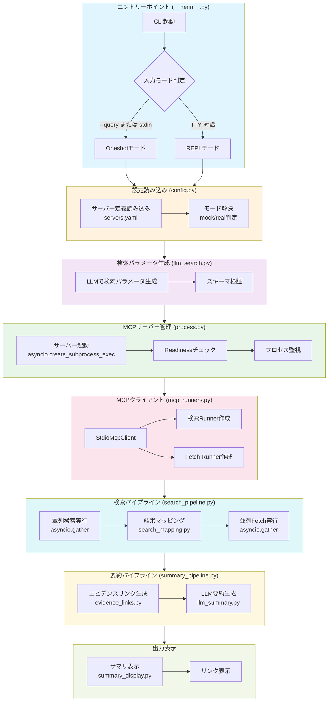
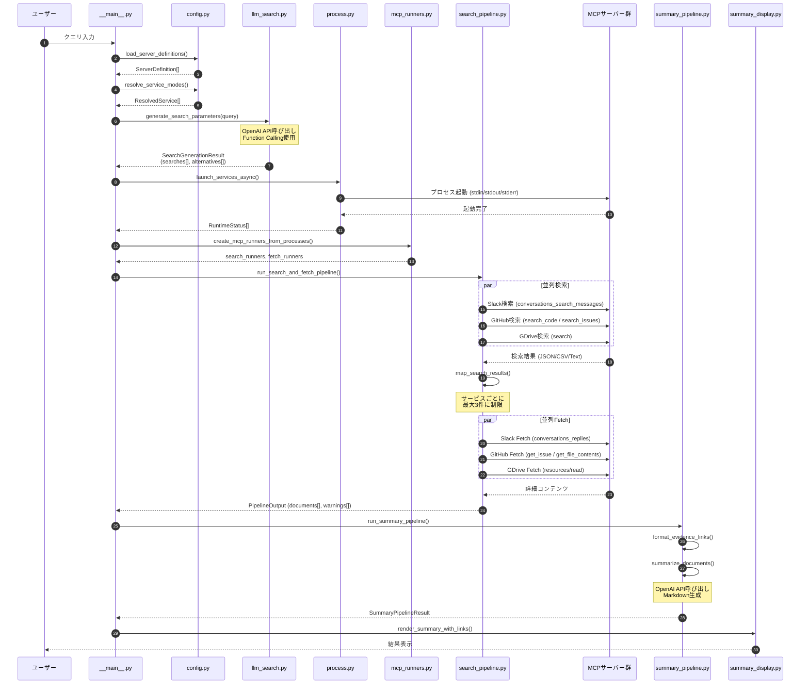
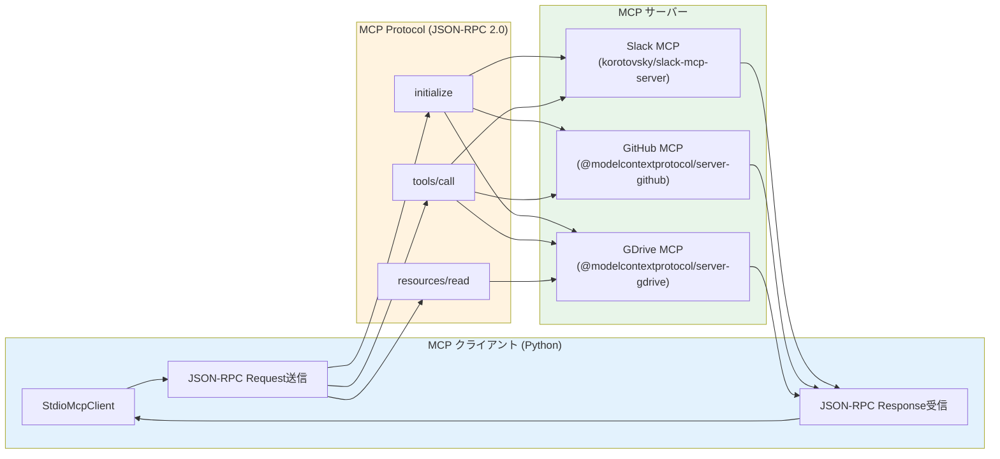
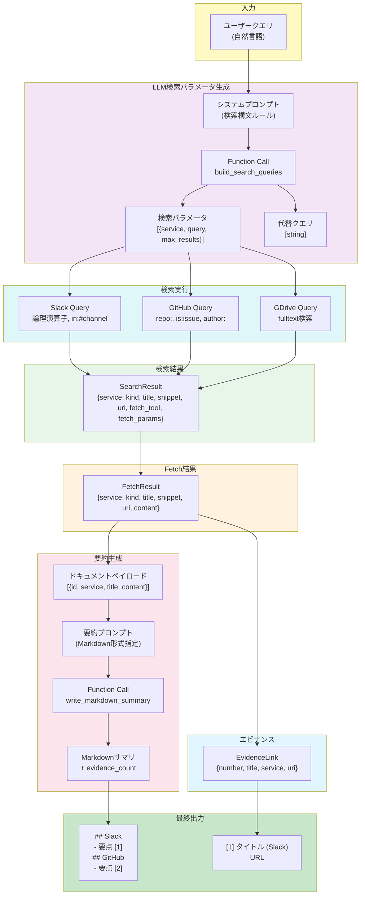
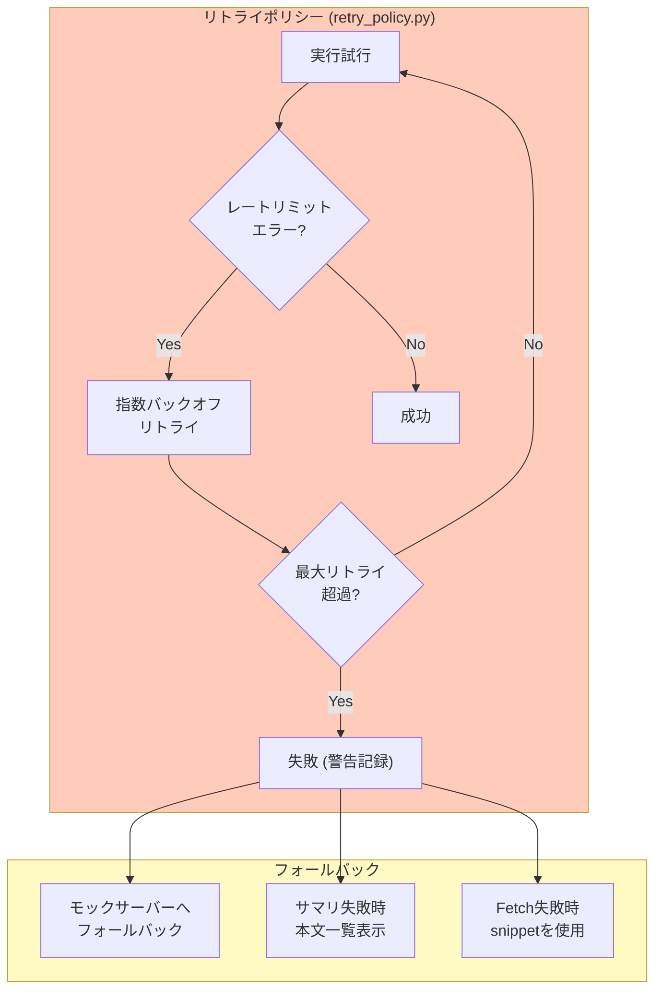
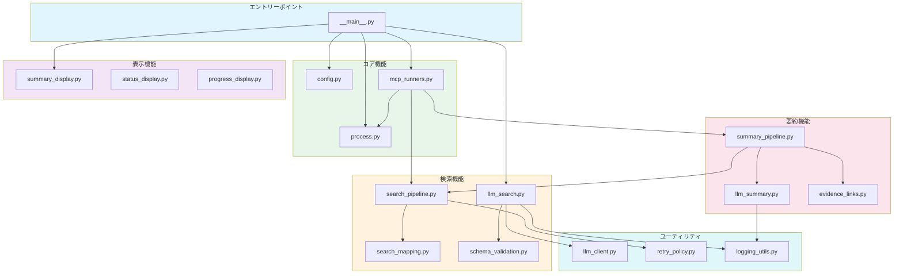
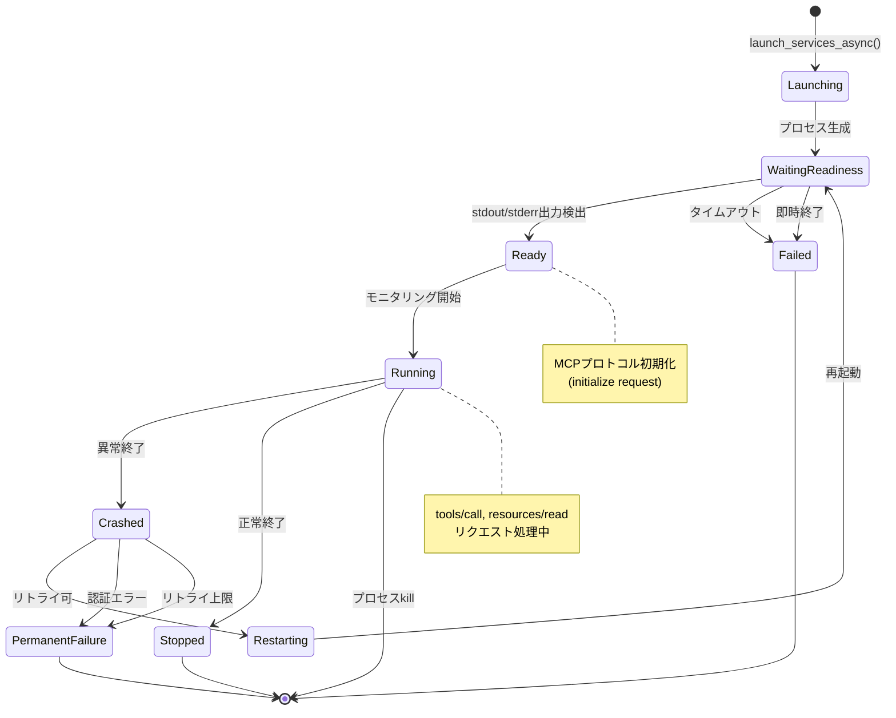
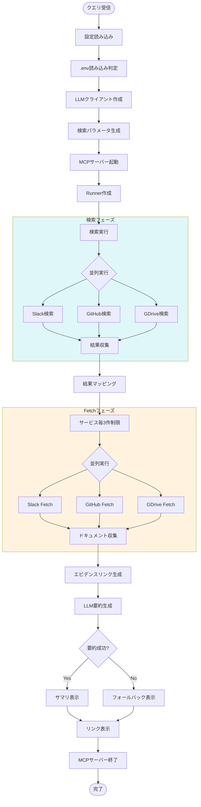

# MCP Workspace Finder - システムアーキテクチャ図

このドキュメントでは、検索処理の流れを複数の観点からMermaid図表で説明します。

## 1. 全体処理フロー（High-Level Flow）

## 2. 検索実行シーケンス図

## 3. MCPサーバー通信詳細

## 4. 検索ツール対応表

```mermaid
flowchart TB
    subgraph Slack["Slack"]
        SlackSearch[["検索: conversations_search_messages"]]
        SlackFetch[["Fetch: conversations_replies"]]
        SlackFormat["CSV形式<br/>MsgID,UserID,UserName,..."]
    end

    subgraph GitHub["GitHub"]
        GitHubCode[["検索: search_code"]]
        GitHubIssues[["検索: search_issues"]]
        GitHubFetchIssue[["Fetch: get_issue"]]
        GitHubFetchFile[["Fetch: get_file_contents"]]
        GitHubFormat["JSON形式<br/>{items: [...]}"]
    end

    subgraph GDrive["Google Drive"]
        GDriveSearch[["検索: search"]]
        GDriveFetch[["Fetch: resources/read"]]
        GDriveFormat["Text形式<br/>Found N files:..."]
    end

    SlackSearch --> SlackFormat --> SlackFetch
    GitHubCode --> GitHubFormat --> GitHubFetchFile
    GitHubIssues --> GitHubFormat --> GitHubFetchIssue
    GDriveSearch --> GDriveFormat --> GDriveFetch

    style Slack fill:#e1bee7
    style GitHub fill:#c8e6c9
    style GDrive fill:#bbdefb
```

## 5. データフロー詳細

## 6. エラーハンドリング・リトライフロー

## 7. モジュール依存関係

## 8. 状態遷移図（MCPサーバープロセス）

## 9. Oneshotモード処理の詳細フロー

---

## 凡例

| 色           | 意味                     |
| ------------ | ------------------------ |
| 🔵 青系       | エントリーポイント・表示 |
| 🟢 緑系       | サーバー管理・プロセス   |
| 🟡 黄系       | 検索処理                 |
| 🟣 紫系       | LLM連携                  |
| 🟠 オレンジ系 | データ変換・マッピング   |
| 🔴 赤系       | エラー処理・リトライ     |

